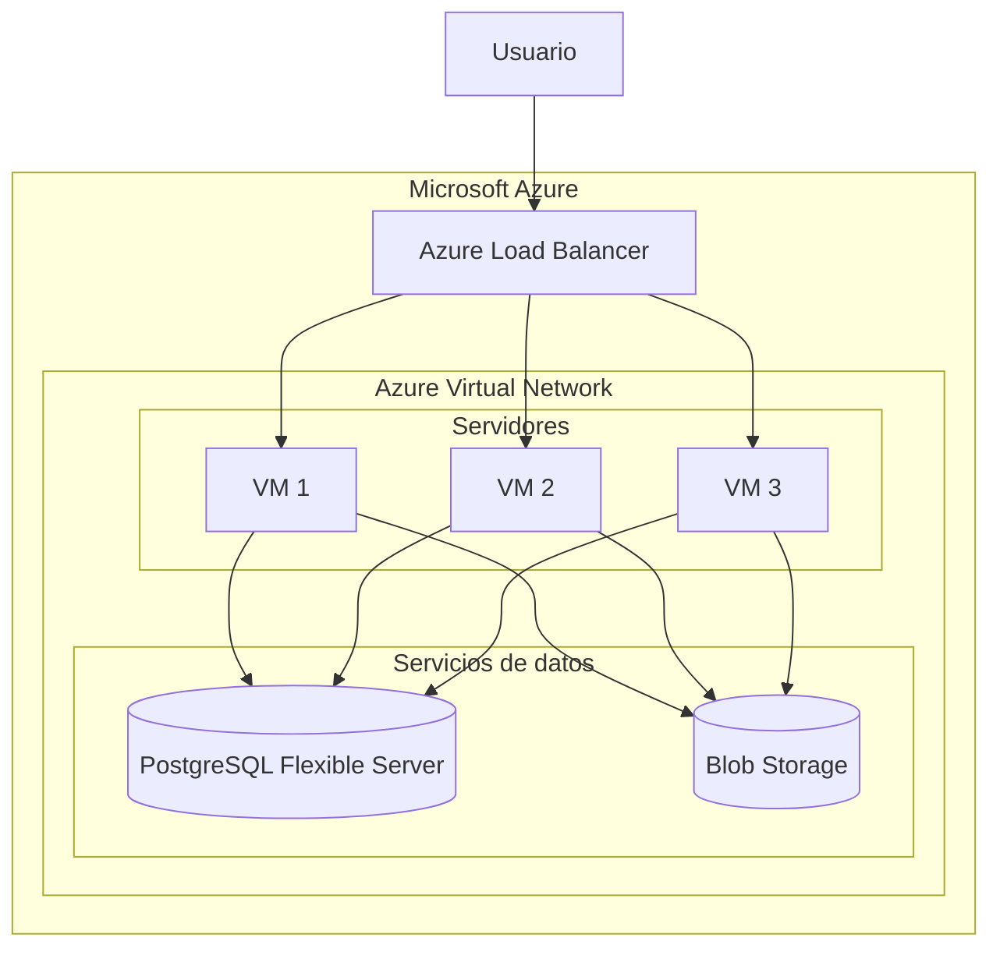

# Arquitectura en la Nube

## Descripción General

Para garantizar la disponibilidad, escalabilidad y persistencia de la información, se diseñó una arquitectura basada en servicios de Microsoft Azure. La solución permite distribuir las solicitudes de los usuarios entre múltiples instancias de la aplicación, almacenar información transaccional de forma segura y gestionar archivos externos mediante un servicio especializado de almacenamiento.

La arquitectura sigue un modelo multicapa, separando la lógica de negocio, el almacenamiento de datos y el almacenamiento de archivos. Esta separación facilita el mantenimiento del sistema, mejora la escalabilidad y permite que cada componente evolucione de forma independiente según las necesidades de la aplicación.

Adicionalmente, la infraestructura fue diseñada considerando criterios de alta disponibilidad, tolerancia a fallos y crecimiento futuro, permitiendo incrementar la capacidad del sistema sin realizar modificaciones significativas en la arquitectura.

## Diagrama de Arquitectura

## Componentes Utilizados

### Azure Virtual Network (VNet)

Todos los recursos de la infraestructura se encuentran desplegados dentro de una red virtual de Azure. La VNet permite aislar los componentes internos de la aplicación y controlar el flujo de comunicación entre ellos.

La red se divide lógicamente en una capa de servidores y una capa de servicios de datos, favoreciendo una mejor organización de la infraestructura y permitiendo implementar controles de seguridad más específicos en cada segmento.

### Azure Load Balancer

Se implementó un balanceador de carga para distribuir las solicitudes entrantes entre múltiples instancias del servidor de aplicación. Esto permite evitar puntos únicos de falla, mejorar la disponibilidad del sistema y distribuir la carga de trabajo de manera uniforme entre los servidores.

Asimismo, en caso de que una máquina virtual deje de responder, el balanceador puede redirigir automáticamente las solicitudes hacia las instancias restantes, contribuyendo a la continuidad operativa del servicio.

### Máquinas Virtuales de Azure

Las máquinas virtuales alojan la aplicación web y la lógica de negocio del sistema. Se eligió esta solución debido a la flexibilidad que ofrece para desplegar aplicaciones personalizadas y controlar completamente el entorno de ejecución.

Las máquinas virtuales serán desplegadas en la región México Central, distribuyéndose entre distintas zonas de disponibilidad. Esta estrategia permite que la aplicación continúe operando incluso si una zona de disponibilidad experimenta una interrupción, mejorando significativamente la resiliencia de la solución.

### Azure Database for PostgreSQL Flexible Server

La información transaccional del sistema se almacena en PostgreSQL Flexible Server. Este servicio administrado reduce las tareas de mantenimiento de la base de datos y proporciona mecanismos de respaldo, monitoreo, actualización y alta disponibilidad.

Al tratarse de un servicio administrado, se disminuye la complejidad operativa asociada a la administración de servidores de bases de datos, permitiendo concentrar los esfuerzos en el desarrollo de la aplicación.

### Azure Blob Storage

Se utiliza Blob Storage para almacenar archivos generados por la aplicación, documentación y recursos multimedia, especialmente las imágenes generadas por los usuarios.

Esta decisión permite desacoplar el almacenamiento de archivos del almacenamiento transaccional, mejorando la escalabilidad del sistema y reduciendo la carga sobre la base de datos. Además, Blob Storage ofrece alta durabilidad y disponibilidad para grandes volúmenes de información no estructurada.

## Seguridad

Los servicios de almacenamiento y base de datos no son accedidos directamente por los usuarios finales. Toda interacción con PostgreSQL Flexible Server y Azure Blob Storage se realiza a través de las máquinas virtuales de la aplicación dentro de la red virtual.

Este enfoque reduce la superficie de exposición de la infraestructura y centraliza el acceso a los recursos críticos mediante la capa de aplicación.

## Flujo de Operación

1. El usuario realiza una solicitud a la aplicación.
2. Azure Load Balancer recibe la petición.
3. El balanceador selecciona una de las máquinas virtuales disponibles.
4. La aplicación procesa la operación solicitada.
5. Si la operación requiere información transaccional, se consulta PostgreSQL Flexible Server.
6. Si la operación requiere almacenar o recuperar archivos, se interactúa con Azure Blob Storage.
7. La aplicación genera la respuesta correspondiente.
8. La respuesta es enviada al usuario.

## Escalabilidad

La arquitectura permite aumentar la capacidad de procesamiento mediante la incorporación de nuevas máquinas virtuales detrás del Azure Load Balancer. Esto facilita la adaptación del sistema a incrementos en la demanda sin necesidad de rediseñar la infraestructura existente.

Asimismo, tanto PostgreSQL Flexible Server como Azure Blob Storage pueden escalar para soportar mayores volúmenes de información y usuarios concurrentes.

## Justificación de la Arquitectura

La arquitectura propuesta busca combinar disponibilidad, escalabilidad, seguridad y simplicidad operativa.

El uso de múltiples máquinas virtuales detrás de un balanceador de carga permite distribuir eficientemente las solicitudes y reducir el impacto de posibles fallos de infraestructura. La distribución de las máquinas virtuales entre distintas zonas de disponibilidad incrementa la tolerancia a fallos y mejora la continuidad del servicio.

Por otra parte, PostgreSQL Flexible Server y Azure Blob Storage proporcionan servicios administrados que reducen la complejidad de administración y mantenimiento, permitiendo enfocar los esfuerzos del equipo en el desarrollo y evolución de la aplicación.

Finalmente, la arquitectura seleccionada ofrece un equilibrio adecuado entre costo, rendimiento y capacidad de crecimiento, siendo una solución apropiada para aplicaciones web que requieren alta disponibilidad y almacenamiento persistente de información.
