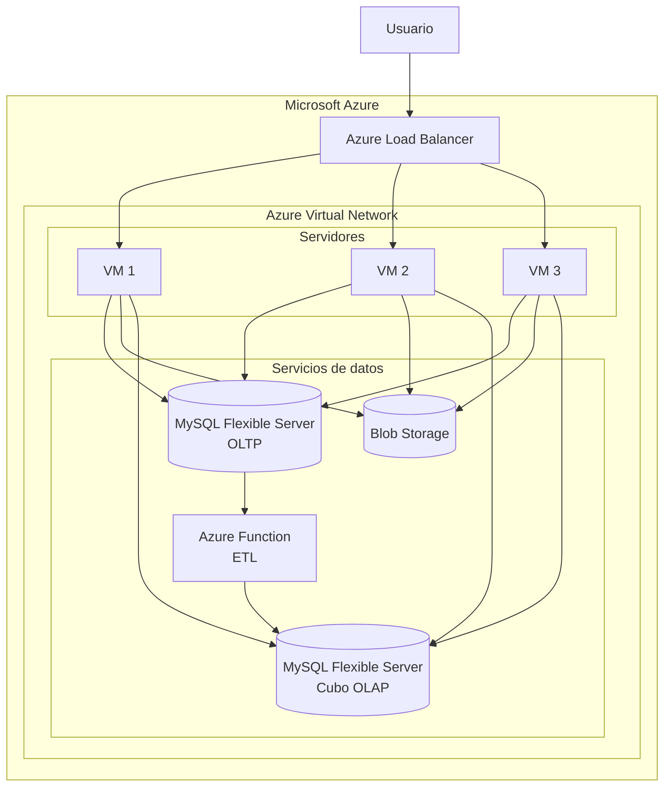

# Arquitectura en la Nube

## Descripción General

Para garantizar la disponibilidad, escalabilidad y persistencia de la información, se diseñó una arquitectura basada en servicios de Microsoft Azure. La solución permite distribuir las solicitudes de los usuarios entre múltiples instancias de la aplicación, almacenar información transaccional de forma segura y gestionar archivos externos mediante un servicio especializado de almacenamiento.

La arquitectura sigue un modelo multicapa, separando la lógica de negocio, el almacenamiento de datos y el almacenamiento de archivos. Esta separación facilita el mantenimiento del sistema, mejora la escalabilidad y permite que cada componente evolucione de forma independiente según las necesidades de la aplicación.

Adicionalmente, la infraestructura fue diseñada considerando criterios de alta disponibilidad, tolerancia a fallos y crecimiento futuro, permitiendo incrementar la capacidad del sistema sin realizar modificaciones significativas en la arquitectura.

## Diagrama de Arquitectura

## Componentes Utilizados

### Azure Virtual Network (VNet)

Todos los recursos de la infraestructura se encuentran desplegados dentro de una red virtual de Azure. La VNet permite aislar los componentes internos de la aplicación y controlar el flujo de comunicación entre ellos.

La red se divide lógicamente en una capa de servidores y una capa de servicios de datos, favoreciendo una mejor organización de la infraestructura y permitiendo implementar controles de seguridad más específicos en cada segmento.

### Azure Load Balancer

Se implementó un balanceador de carga para distribuir las solicitudes entrantes entre múltiples instancias del servidor de aplicación. Esto permite evitar puntos únicos de falla, mejorar la disponibilidad del sistema y distribuir la carga de trabajo de manera uniforme entre los servidores.

Asimismo, en caso de que una máquina virtual deje de responder, el balanceador puede redirigir automáticamente las solicitudes hacia las instancias restantes, contribuyendo a la continuidad operativa del servicio.

### Máquinas Virtuales de Azure

Las máquinas virtuales alojan la aplicación web y la lógica de negocio del sistema. Se eligió esta solución debido a la flexibilidad que ofrece para desplegar aplicaciones personalizadas y controlar completamente el entorno de ejecución.

Las máquinas virtuales serán desplegadas en la región México Central, distribuyéndose entre distintas zonas de disponibilidad. Esta estrategia permite que la aplicación continúe operando incluso si una zona de disponibilidad experimenta una interrupción, mejorando significativamente la resiliencia de la solución.

### Base de datos OLTP (Azure MySQL Flexible Server)

La información transaccional del sistema se almacena en MySQL Flexible Server. Este servicio administrado reduce las tareas de mantenimiento de la base de datos y proporciona mecanismos de respaldo, monitoreo, actualización y alta disponibilidad.

Al tratarse de un servicio administrado, se disminuye la complejidad operativa asociada a la administración de servidores de bases de datos, permitiendo concentrar los esfuerzos en el desarrollo de la aplicación.

### Azure Blob Storage

Se utiliza Blob Storage para almacenar archivos generados por la aplicación, documentación y recursos multimedia, especialmente las imágenes generadas por los usuarios.

Esta decisión permite desacoplar el almacenamiento de archivos del almacenamiento transaccional, mejorando la escalabilidad del sistema y reduciendo la carga sobre la base de datos. Además, Blob Storage ofrece alta durabilidad y disponibilidad para grandes volúmenes de información no estructurada.

### Azure Functions (ETL)

Se utilizará Azure Functions para implementar el proceso de Extracción, Transformación y Carga (ETL) encargado de alimentar el entorno analítico del sistema. La función será ejecutada de manera programada mediante un disparador temporal (Timer Trigger), permitiendo automatizar la transferencia de información desde la base de datos transaccional hacia el repositorio analítico.

Durante cada ejecución, la función extraerá los datos necesarios desde MySQL Flexible Server, realizará las transformaciones requeridas para el análisis de información y cargará los resultados en la base de datos destinada al cubo OLAP.

La utilización de Azure Functions permite reducir costos operativos al ejecutar recursos únicamente cuando son necesarios, además de eliminar la necesidad de mantener servidores dedicados para los procesos ETL.

### Base de Datos OLAP (Azure MySQL Flexible Server)

Se implementará una segunda base de datos utilizando MySQL Flexible Server, destinada exclusivamente al almacenamiento del cubo OLAP y de las estructuras analíticas del sistema.

Esta base de datos contendrá tablas de hechos, dimensiones y agregaciones optimizadas para consultas analíticas, generación de reportes e indicadores de desempeño. Al mantener separadas las cargas transaccionales y analíticas, se evita que las consultas complejas afecten el rendimiento de la aplicación principal.

La información almacenada en este entorno será actualizada periódicamente mediante el proceso ETL ejecutado por Azure Functions, garantizando que los análisis se realicen sobre datos consolidados y preparados para la toma de decisiones.

Esta arquitectura permite escalar de manera independiente los componentes transaccionales y analíticos, facilitando el crecimiento futuro del sistema y mejorando el rendimiento general de las consultas de inteligencia de negocio.

## Seguridad

Los servicios de almacenamiento y base de datos no son accedidos directamente por los usuarios finales. Toda interacción con MySQL Flexible Server y Azure Blob Storage se realiza a través de las máquinas virtuales de la aplicación dentro de la red virtual.

Este enfoque reduce la superficie de exposición de la infraestructura y centraliza el acceso a los recursos críticos mediante la capa de aplicación.

## Flujo de Operación

1. El usuario realiza una solicitud a la aplicación web.
2. Azure Load Balancer recibe la petición entrante.
3. El balanceador selecciona una de las máquinas virtuales disponibles para atender la solicitud.
4. La máquina virtual ejecuta la lógica de negocio correspondiente.
5. Si la operación requiere realizar transacciones, consultas operativas o modificaciones de datos, la aplicación interactúa con OLTP MySQL Flexible Server.
6. Si la operación requiere almacenar o recuperar archivos, la aplicación interactúa con Azure Blob Storage.
7. Si la solicitud corresponde a reportes, indicadores o análisis de información, la aplicación consulta la base de datos OLAP alojada en MySQL Flexible Server.
8. De manera independiente al flujo de atención de usuarios, Azure Functions ejecuta periódicamente el proceso ETL.
9. El proceso ETL extrae información desde OLTP MySQL Flexible Server, realiza las transformaciones necesarias y carga los datos consolidados en la base de datos OLAP.
10. La aplicación genera la respuesta correspondiente utilizando la información obtenida de los distintos servicios.
11. La respuesta es enviada al usuario.

## Escalabilidad

La arquitectura permite aumentar la capacidad de procesamiento mediante la incorporación de nuevas máquinas virtuales detrás de Azure Load Balancer. Esto facilita la adaptación del sistema a incrementos en la demanda sin necesidad de rediseñar la infraestructura existente.

Asimismo, el servidor MySQL Flexible Server destinado al procesamiento transaccional (OLTP) puede escalar para soportar mayores volúmenes de operaciones concurrentes, mientras que Azure Blob Storage permite incrementar la capacidad de almacenamiento de archivos, documentos y recursos multimedia conforme crecen las necesidades de la plataforma.

De manera independiente, el servidor MySQL Flexible Server destinado al procesamiento analítico (OLAP) puede escalar para soportar consultas complejas, generación de indicadores, reportes ejecutivos y análisis históricos sin afectar el rendimiento de las operaciones transaccionales del sistema.

El proceso ETL implementado mediante Azure Functions opera de forma desacoplada de la aplicación principal y puede adaptarse a mayores volúmenes de información mediante mecanismos de escalado administrados por la plataforma Azure. Esto permite procesar y transferir grandes cantidades de datos desde el entorno OLTP hacia el entorno OLAP sin requerir servidores dedicados para las tareas de integración.

Gracias a esta arquitectura, los componentes de aplicación, almacenamiento transaccional (MySQL Flexible Server OLTP), almacenamiento analítico (MySQL Flexible Server OLAP), almacenamiento de archivos (Azure Blob Storage) y procesamiento ETL (Azure Functions) pueden escalar de manera independiente, optimizando costos y garantizando un desempeño adecuado ante el crecimiento futuro del sistema.

## Justificación de la Arquitectura

La arquitectura propuesta busca combinar disponibilidad, escalabilidad, seguridad, capacidad analítica y simplicidad operativa.

El uso de múltiples máquinas virtuales detrás de un balanceador de carga permite distribuir eficientemente las solicitudes y reducir el impacto de posibles fallos de infraestructura. La distribución de las máquinas virtuales entre distintas zonas de disponibilidad incrementa la tolerancia a fallos y mejora la continuidad del servicio.

Por otra parte, el uso de MySQL Flexible Server para el procesamiento transaccional (OLTP) permite gestionar las operaciones diarias de la aplicación de manera eficiente, mientras que Azure Blob Storage proporciona un mecanismo escalable y altamente disponible para el almacenamiento de archivos, documentos y recursos multimedia. Al tratarse de servicios administrados, se reduce significativamente la complejidad asociada a las tareas de administración, mantenimiento, monitoreo y respaldo.

Adicionalmente, la incorporación de un segundo MySQL Flexible Server destinado al procesamiento analítico (OLAP) permite separar las cargas de trabajo transaccionales de las analíticas. Esta estrategia evita que las consultas complejas de reporteo, indicadores y análisis histórico afecten el rendimiento de las operaciones diarias de la aplicación.

Para mantener sincronizados ambos entornos, se utiliza Azure Functions como plataforma para la ejecución de procesos ETL (Extracción, Transformación y Carga), permitiendo transferir periódicamente la información desde el entorno OLTP hacia el entorno OLAP de forma automatizada y con costos operativos reducidos.

Finalmente, la arquitectura seleccionada ofrece un equilibrio adecuado entre costo, rendimiento, disponibilidad y capacidad de crecimiento. La separación entre los entornos OLTP y OLAP, junto con el uso de servicios administrados de Azure, proporciona una solución robusta y escalable para aplicaciones web que requieren procesamiento transaccional, análisis de información y almacenamiento persistente de datos.
