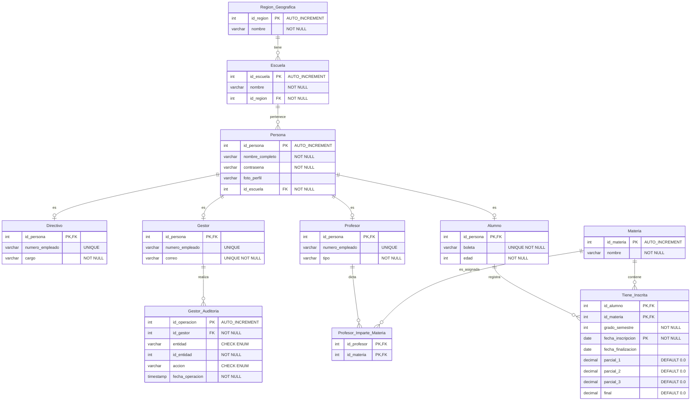

# Modelo de Base de Datos SAES

## Descripción General

Para garantizar la integridad relacional, el control de acceso y la preparación analítica del sistema, se diseñó una arquitectura de base de datos estructurada en MySQL 8. La solución permite gestionar entidades geográficas, usuarios jerárquicos y procesos académicos transaccionales (CRUD), manteniendo un historial detallado para su futura explotación en un modelo multidimensional (OLAP).

El esquema sigue un modelo de normalización avanzado, utilizando herencia de tablas para separar la identidad general de los usuarios de sus roles específicos. Esta separación elimina la redundancia de datos, agiliza las consultas y permite un control de permisos granular directamente desde el motor de la base de datos.

---

## Componentes Utilizados

### 1. Tablas de Infraestructura Geográfica

**Idea Central:** Segmentación física para habilitar la visualización en mapas de la República.

- **Región Geográfica:** Almacena los identificadores espaciales (estados y municipios).
- **Escuela:** Depende directamente de la región y actúa como el ancla para todos los usuarios del sistema.

### 2. Superclase y Subclases de Identidad

**Idea Central:** Centralización de credenciales y perfiles mediante herencia de datos (Estrategia *Tabla por Subclase*).

#### Persona (Superclase)
Almacena de forma centralizada:
- Contraseñas.
- Fotografías de perfil.
- Adscripción a la escuela.

Constituye el único punto de autenticación del sistema.

#### Roles (Subclases)

- **Alumno**
- **Profesor**
- **Gestor**
- **Directivo**

Cada una hereda el identificador de **Persona** mediante una relación 1:1 y almacena únicamente los atributos exclusivos de su cargo, tales como:

- Boleta.
- Tipo de contrato.
- Cargo directivo.

### 3. Catálogo y Relaciones Académicas (M:N)

**Idea Central:** Resolución de relaciones muchos a muchos para el control transaccional del SAES.

#### Materia
Catálogo base de asignaturas.

#### Tiene_Inscrita (Tabla Intermedia)

Relaciona alumnos con materias y almacena:

- Calificación parcial 1.
- Calificación parcial 2.
- Calificación parcial 3.
- Grado.
- Semestre.

#### Profesor_Imparte_Materia (Tabla Intermedia)

Relaciona profesores con materias para determinar qué docentes tienen autorización para registrar calificaciones.

### 4. Módulo de Auditoría

**Idea Central:** Trazabilidad estricta de los movimientos administrativos.

#### Gestor_Auditoria

Bitácora inmutable que registra:

- Qué gestor ejecutó la operación.
- Altas realizadas.
- Bajas realizadas.
- Modificaciones efectuadas.

Esto permite prevenir alteraciones no autorizadas y mantener evidencia histórica de los cambios.

---

## Seguridad y Control de Acceso (RBAC)

Se implementó el principio de mínimo privilegio utilizando el sistema nativo de **GRANT** y **REVOKE** de MySQL, complementado con restricciones en el backend.

### Directivo
- Acceso total a la gestión de usuarios administrativos.
- CRUD completo sobre gestores.

### Gestor
- Inserción y modificación de alumnos.
- Inserción y modificación de profesores.
- Gestión de inscripciones.
- Sin permisos para modificar calificaciones.

### Profesor
- Único rol con capacidad de realizar `UPDATE` sobre:
  - `parcial_1`
  - `parcial_2`
  - `parcial_3`

de la tabla **Tiene_Inscrita**.

El backend restringe además que únicamente pueda modificar alumnos asociados a sus materias.

### Alumno
- Permisos de solo lectura (`SELECT`) sobre su historial académico.
- Permiso de escritura limitado a la actualización de su fotografía de perfil.

---

## Flujo de Operación (Automatización)

Para garantizar la exactitud de los promedios y reducir la carga de procesamiento del backend, se implementaron mecanismos automatizados dentro del motor SQL.

### Flujo

1. El profesor captura o actualiza una calificación parcial.
2. La instrucción `INSERT` o `UPDATE` llega a la tabla **Tiene_Inscrita**.
3. Un **Trigger** de MySQL intercepta la operación.
4. El motor calcula automáticamente el promedio de los tres parciales.
5. La fila se almacena con la calificación final actualizada de manera consistente.

---

## Escalabilidad (Preparación OLAP)

El diseño relacional fue construido considerando una futura integración con herramientas analíticas y de inteligencia de negocios.

### Dimensión de Tiempo

Se incorporan los atributos:

- `fecha_inscripcion`
- `fecha_finalizacion`

en la tabla de inscripciones.

Esto permite realizar análisis históricos del desempeño académico.

### Modelado en Estrella

La estructura actual facilita una migración directa hacia un esquema dimensional:

#### Dimensiones
- Región
- Escuela
- Materia
- Tiempo

#### Tabla de Hechos
- Tiene_Inscrita

A partir de esta tabla es posible calcular:

- Promedios.
- Varianzas.
- Tendencias académicas.
- Indicadores de desempeño institucional.

---

## Justificación del Diseño

El esquema propuesto busca combinar:

- Normalización estricta.
- Seguridad a nivel de datos.
- Escalabilidad analítica.

La utilización de herencia mediante la tabla **Persona** elimina redundancia de información, centraliza la autenticación y facilita la integración con servicios externos como el almacenamiento de fotografías en Blob Storage.

Asimismo, restringir la actualización de calificaciones al rol de **Profesor** y respaldar la lógica mediante **Triggers** garantiza la integridad académica y minimiza riesgos de manipulación administrativa.

Finalmente, la arquitectura se encuentra preparada para integrarse con herramientas de Business Intelligence, Machine Learning y sistemas de visualización geográfica, permitiendo que la solución evolucione más allá de un sistema CRUD tradicional hacia una plataforma analítica completa.